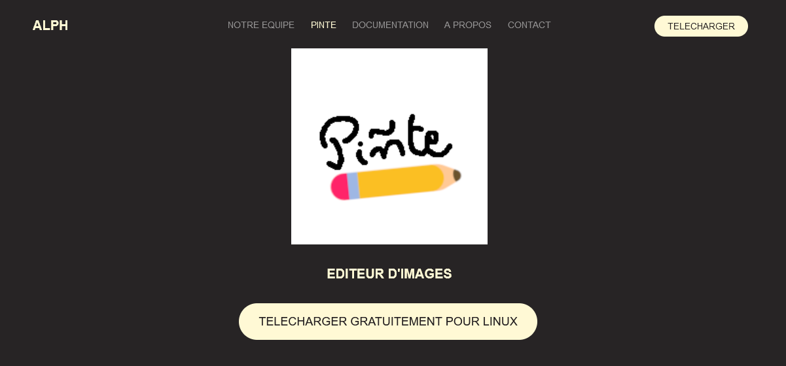
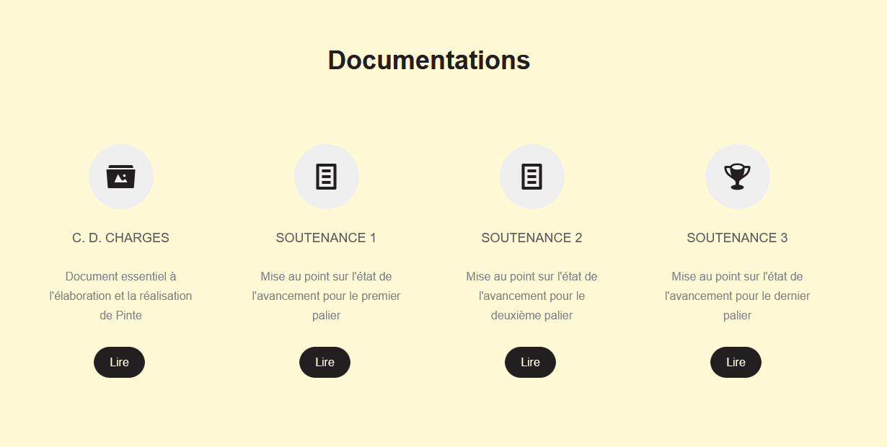
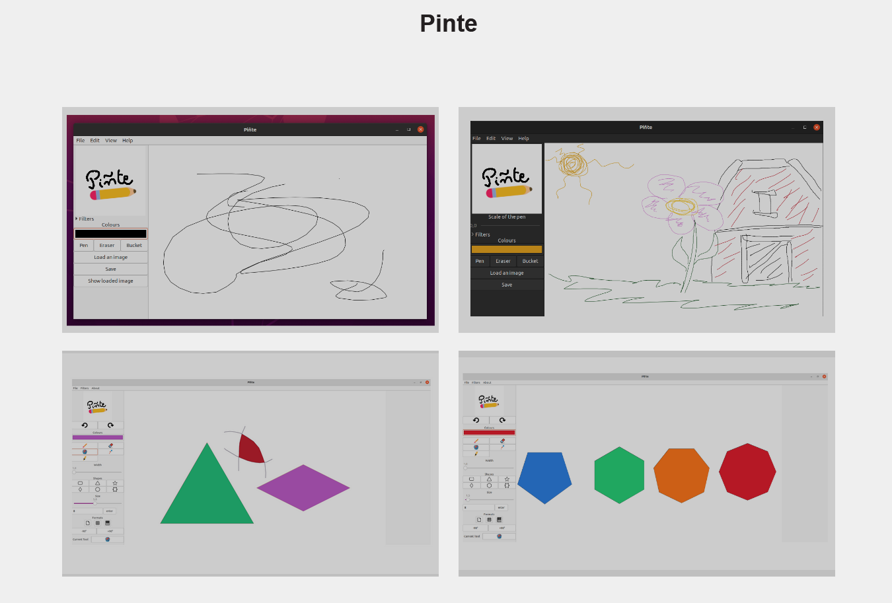

# PINTE

Project for 4th semester at EPITA.

This project focuses on creating a user-friendly software application that allows users to draw or modify images, providing a platform for creative expression. The graphical interface enables users to load an image from a file explorer and either draw on it or manipulate it. The edited image can then be saved to the user's local files. The application features a clean and simple interface, prioritizing ease of use. The core algorithmic interest lies in image processing and editing, particularly in the modification and storage of pixels. Users start with a blank canvas where they can draw using various tools or edit an image they load into the application.

# RUN

- Go in src/gtk/:
	- use `make` to compile the application 
	- lauch it by using `./main`

# Website

Visit the Pinte [website](https://akaagi.github.io/Pinte_Website/accueil.html) to find the download link and access all related documentation, including the production specifications and the project report.

# Preview

# AUTHORS

Leo DEVIN\
Angelo EAP\
Phu-Hung DANG\
Cristophe NGUYEN